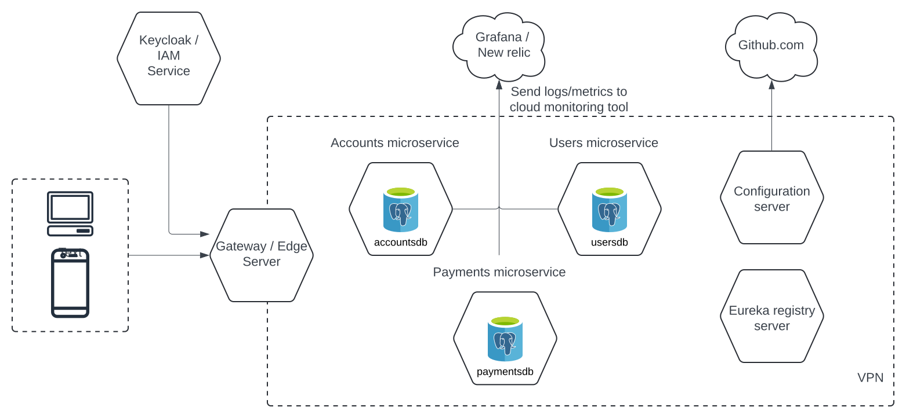

# Finobank

## Architecture diagram

## How to start the application

The application uses docker-compose to start. All the docker images are hosted
at https://hub.docker.com/u/rohitkalaghatkar

### Prerequisites

- Docker

### Steps to run the application

- Clone the repository on local
- `cd docker-compose/finobank/docker-compose.yml`
- `docker-compose up -d`

## How to compile the application

### Prerequisites

- JDK 21
- Maven

### Steps to compile and build docker images of the application

1. Clone the repository on local
2. `mvn clean install jib:build` -- NOTE: This compiles and builds docker image and pushes the image to the author's
   docker private repository.
   INFO: `mvn clean install jib:dockerBuild` This compiles and build docker image and pushes the image to local
   repository

## Microservices hosted

1. Configuration server - http://localhost:8071/
2. Registry server - http://localhost:8070/
3. Gateway / Edge server - http://localhost:8072/
4. Accounts microservice - http://localhost:8080/
    - Postgres RDBMS - http://localhost:5432/accountsdb
5. Payments microservice - http://localhost:8081/
    - Postgres RDBMS - http://localhost:5433/paymentsdb
6. Users microservice - http://localhost:8082/
    - Postgres RDBMS - http://localhost:5434/usersdb
7. Keycloak / IAM service - http://localhost:8060/
    - Postgres RDBMS - http://localhost:5431/keycloakdb

## Configuration:

### Database

All Postgres RDBMS database are configured to use below credentials:

- username: **postgres**
- password: **postgres**

### Swagger UI

There exists a bug to access swagger ui from gateway
server [Accounts Gateway swagger ui](http://localhost:8072/docs/accounts/swagger-ui/index.html) URI. Instead, please use
swagger ui for individual microservices.

- Account: [Swagger UI](http://localhost:8080/swagger-ui/index.html)
- Payments: [Swagger UI](http://localhost:8081/swagger-ui/index.html)
- Users: [Swagger UI](http://localhost:8082/swagger-ui/index.html)

### Keycloak server

To access keycloak server [click here](http://localhost:8060/)

- username: **admin**
- password: **admin**

### postman

This tool is used to call application endpoints. Please download and install
from [here](https://www.postman.com/downloads/). After successful installation. Please import all the endpoints
configuration from postman folder. The postman configuration configures keycloak authentication endpoints and all the
application endpoints.

## Features implemented

### Main requirements

- Authentication using keycloak IAM service
- List the bank accounts for authenticated user
- Create a single payment
- List all payments
- Delete a payment by ID
- Logout endpoint -- Not implemented

### Optional requirements

- Dockerized entire application
- Implemented OpenApi and Swagger documentation for microservices